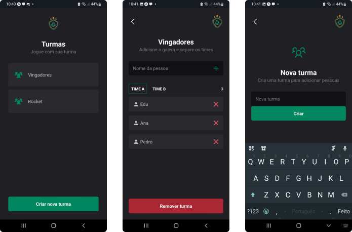

  <a href="#-tecnologias">Tecnologias</a>&nbsp;&nbsp;&nbsp;|&nbsp;&nbsp;&nbsp;
  <a href="#-projeto">Projeto</a>&nbsp;&nbsp;&nbsp;|&nbsp;&nbsp;&nbsp;
  <a href="#-layout">Layout</a>&nbsp;&nbsp;&nbsp;|&nbsp;&nbsp;&nbsp;
  <a href="#-como-executar">Como executar</a>&nbsp;&nbsp;&nbsp;|&nbsp;&nbsp;&nbsp;

 

## ✨ Tecnologias

Esse projeto foi desenvolvido utilizando as seguintes tecnologias:

- [React Native](https://reactnative.dev/)
- [TypeScript](https://www.typescriptlang.org/)
- [Expo](https://expo.dev/)
- [Styled Components](https://styled-components.com/)

## 💻 Projeto

Ignite Teams é uma aplicação mobile desenvolvida no bootcamp Ignite da Rocketseat usando boas praticas do desenvolvimento mobile. Ela consiste em criar turmas e adicionar jogadores em equipes. 

## 🔖 Layout

  

## 🚀 Como executar

- Clone o repositório do projeto
`git clone git@github.com:luanyata/Ignite-Teams.git`
- Instale as dependências com `yarn`
- Inicie a aplicação com `npx expo start`
- Com o Expo Go aberto em seu dispositivo, escaneie o QR code no terminal<
